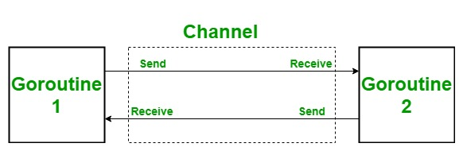

# Goroutine & Channel


## Goroutine
ในภาษา go ผู้ใช้งานไม่สามารถเรียกใช้งาน Thread ได้โดยตรงได้ ​ซึ่งภาษา go ได้สร้าง keyword ที่ใช้งานทดแทน thread นั้นคือ
go ที่เป็น keyword built-in มาในภาษา เพื่อลดความซับซ้อนการใช้งาน เพราะการใช้งาน thread ต้องบริหารจัดการเองซึ่งค่อนข้างยากจนหลาย ๆ ครั้งเกิด
thread deadlock  "แต่ไม่ได้หมายความว่า goroutine จะไม่มี deadlock นะแค่โอกาสเกิดน้อยกว่า" 

go keyword จะถูกบริหารจัดการโดย go-runtime และ go-runtime จะเรียกใช้งาน OS threads ให้


  > NOTE : การที่จะใช้งาน go keyword ได้นั้น stement ข้างหลังจำเป็นต้องเป็น function เท่านั้น

**ตัวอย่าง การใช้ go keyword แบบ non-blocking**

```go
package main

import (
    "fmt"
    "time"
)

func hello() {
    fmt.Print("hello ")
}

func main() { 
  go hello()
  time.Sleep(time.Millisecond * 50)
  fmt.Println("world")
}

// hello world
```

ตรง go hello() เป็นการบอก go-runtime ว่าแตก thread ให้หน่อยและ execute hello function ด้วยนะ  
ส่วน time.Sleep เป็นการบอกให้ main thread ทำการ sleep ตัวเอง 50 mlisec เพื่อรอ hello() ทำการ print hello ออกมา

จากตัวอย่างด้านบน หากเจองานที่ไม่สามารถระบุเวลาเสร็จของ function ที่ใช้ร่วมกับ goroutine ได้ เราจะ block มันยังไงเพื่อไม่ให้ function main มันจบการทำงาน ?

**ตัวอย่าง go keyword แบบ blocking**

การที่ program เป็นแบบ non-blocking ทำให้ function main มันจบการทำงานทันที ดังนั้นจำเป็นต้องมีการรอให้ การทำงานที่ใช้ goroutine เสร็จก่อน ซึ่งจะใช้ package ที่ชื่อ sync

```go
package main

import (
    "fmt"
    "time"
    "sync"
)

func hello(wg *sync.WaitGroup) {
    fmt.Print("hello ")
    wg.Done()
}

func main() { 
  wg := sync.WaitGroup{}
  wg.Add(1)
  go hello(&wg)
  wg.Wait()
  fmt.Println("world")
}

// hello world
```

function main  :    

ประกาศ wg และ assign sync.WaitGroup ให้กัับ wg
จากนั้นเรียกใช้ function Add(n int) ของ WaitGroup ซึ่งตรงนี้เป็นการเพิ่มจำนวน count  ที่ต้องการจะรอให้ goroutine ทำงานเสร็จ ตัวอย่างด้านบนมี goroutine แค่ 1 ก็ใส่ลงไปใน Add(1) ซึ่งค่าเริ่มตอนคือ 0 จากนั้นส่ง pointer ของ WaitGroup เข้าไปใน hello(&wg) และสั่งให้โปรแกรม waiting จนกว่า count ของ goroutine จะเท่ากับ 0 ถ้าเท่ากับ 0 แล้วจะทำบรรทัดถัดไป ก็คือ print world ออกมา

function hello :   
 รับ pointer ของ WaitGroup เพื่อทำการลดจำนวน count ของ goroutine โดยการเรีอก Done function ซึ่งการเรียก 1 ครั้งเท่ากับ count ลบทีละ 1 และไม่สามารถติดลบได้ หากติดลบ WaitGroup จะตี panic ทันที 


---

## Channel

ปัญหามีอยู่ว่า หากโปรแกรมของเรามีการใช้ goroutine หลาย ๆ goroutine แต่ละตัวก็จะมีการทำงานที่แตกต่างกันและ goroutine เหล่านั้นต้องการที่จะแลกเปลียน  data กันแล้วจะมีวิธีทำให้ goroutines แลกเปลียนข้อมูลกันได้ไหม ? 

ปัญหานี้แก้ด้วยการใช้ chan ที่ย่อมาจาก channel

channel นั้นคล้ายกับท่อที่ให้ goroutine สามารถแลกเปลียนข้อมูลระหว่างกันได้โดยใช้  <- (arrow) และ channel ยังมีคุณสมบัติ FIFO (First-in First-out) ซึ่งนั้นทำให้ dev ไม่ต้องกังวลกับ data race 




channel แบ่งออกเป็น 2 ชนิด คือ
1. UnBuffered 
2. Buffered
   
**Unbuffered**    
เป็นวิธีการอย่างหนึ่งของ channel ที่ไม่มีการกำหนดขนาด (size) ของ channel เนืองจากการใช้ unbuffered จำเป็นต้องแน่ใจว่า sender ส่งค่าเข้าไปใน channel จำเป็นต้องมี receiver ที่ค่อยนำค่าออกมาไม่อย่างนั้นจะเกิด deadlock เพราะว่า receiver จะ block process จนกว่านำค่าออกจาก channel ได้ หรือไม่มี receiver ก็จะ deadlock เช่นกัน

**Buffered**   
เป็นการเก็บค่าฝากไว้บน ram ชั่วคราวซึ่งจำนวนที่สามารถเก็บได้นั้นขึ้นอยู่กับการกำหนดตอนสร้าง channel ขึ้น ไม่มีการ block process แต่จะเกิด deadlock ขึ้นตอนที่ channel นั้นเต็ม หรือ ไม่มี receiver ก็จะเกิด deadlockเช่นกัน
 
 
 	การเลือกใช้ ประเภทของ chanal ก็ขึ้นอยู่กับงาน ถ้างานที่มี data  sensitive ที่ไม่ควรหาย ควรเลือกใช้ unbuffered เพราะว่า ค่าที่เข้าไปใน channel จำเป็นต้องนำออกมาทันทีโดยไม่มีการ hold ไว้ใน memory 

คุณสมบัติของการสื่อสารแบ่งได้ออกเป็น 2 ชนิด 

1. Two way communication
2. One way communication


**Two way communication**    
channel ชนิดนี้สามารถส่งและรับใน channel เดียวกันสามารถประกาศเป็น func A(c chan string)  signature function แสดงถึงเป็น two way communication

**example**   
```go 
package main

import (
	"fmt"
	"sync"
)

func helloMike(pipe chan   string, wg *sync.WaitGroup) {
	defer wg.Done()
	if s := <- pipe ; s == "Hello Mike" {
		pipe <- "Hi"
		return 
	}
	pipe <- ""
}

func main() {
	wg := &sync.WaitGroup{}
	pipe := make(chan string,1)
	wg.Add(1)
	pipe <- "Hello Mike"
	go helloMike(pipe,wg)
	wg.Wait()
	fmt.Println(<-pipe)
}
```

main ทำการส่ง message "Hello Mike" เข้าไปใน chan pipe จากนั้นทำการ แตก function helloMike  ด้วย goroutine    
ภายใน function helloMike จะทำการตรวจสอบว่า message ที่เข้ามาใช่  "Hello Mike" หรือป่าว ถ้าใช่ให้ตอบ Hi กลับ หากค่าที่ส่งมาไม่ใช่ จะทำการ return empty string  


**One way  communication**   
channel ชนิดนี้สามารถทำได้แค่ รับ หรือ ส่ง อย่างใดอย่างหนึ่งเท่านั้น สามารถประกาศเป็น   
 funcA(c chan <- string) ส่งอย่างเดียว , funcB(c <- chan string) รับอย่างเดียว

```go 
package main

import (
	"fmt"
	"sync"
)

func greet(pipe chan<- string) {
	pipe <- "Hi Puge"
}

func hiPuge(pipe <-chan string) {
	if s := <-pipe; s == "Hi Puge" {
		fmt.Println(s)
	}
}

func main() {
	pipe := make(chan string)
	go greet(pipe)
	hiPuge(pipe)
}

```

สังเกตว่า มี 2 function ที่เป็น รับ และ ส่ง แยกกัน ซึ่ง funcion ที่ทำหน้าที่ส่งคือ greet ส่วน function ที่รับคือ hiPuge หากมีการส่ง channel ผิดประเภท ตัว linter จะแจ้งว่า invalid operation