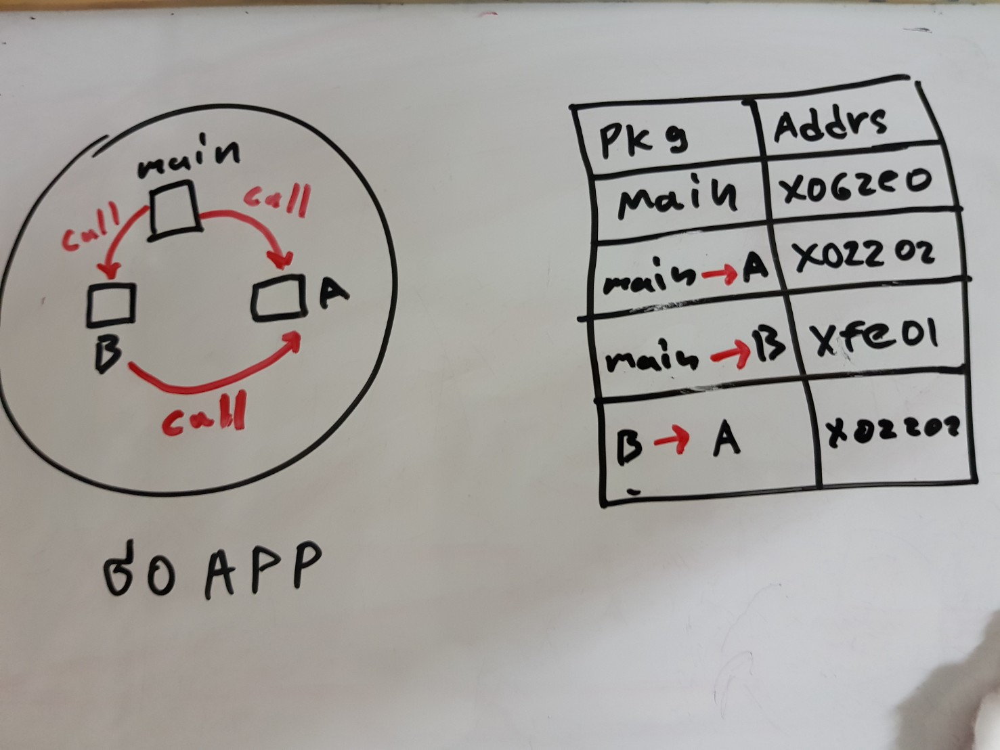

# Package

เป็น collection ของ function , structs, variable , interface ที่มีการเปิดให้ภายนอกเรียกใช้งาน แต่จะสามารถเรียกใช้ได้เฉพาะที่ยินยอมเท่านั้น (public)  Package มีไว้เพื่อแบ่ง scope ของงานออกไปเป็นส่วน ๆ ทำให้การนำไป reuse และ maintain นั้นง่ายขึ้น 

ส่วนการนำไปใข้ ชื่อ package ต้องอ้างอิงตามชื่อ directory  ถ้า directory ชื่อ duck ไพล์ที่อยู่ใน directory duck จะต้องใช้ชื่อ package ว่า duck

package ของ go จะโดน load แค่ครั้งเดียวเท่านั้นทำให้ประหยัด memory ได้มากหากมี package A เรียก package B  go ยินยอมให้มีการ share address ของ package B ไปให้ package A 

