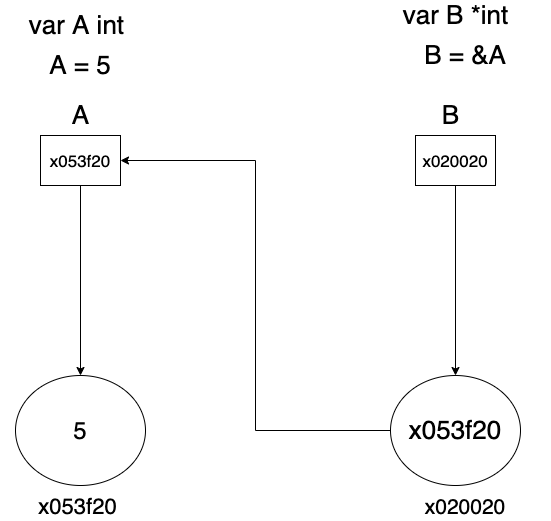

# Pointer

ก่อนที่จะทำความเข้าใจ pointer มาทำความเข้าใจ variable กันก่อน

- ## Variable

  variable หรือที่เรียกกันตัวแปรนั้นไม่ได้เก็บ value แต่มันเก็บตำแหน่ง (address) ของ value ที่อยู่ใน memory ทุก address จะแทนด้วยเลขฐาน 16 (hexadecimal) 

**pointer**  เป็นสิ่งที่ทำให้เข้าถึง memory address ของ value ที่อยู่ใน memory ซึ่ง pointer จะใช้ร่วมกับ type เช่น int , string ,float , struct และทุกชนิดที่เป็น type

    var Intptr *int
    var Strptr *string
    var FloatPtr *float32

การที่นำ * มาไว้หน้า type เป็นการบอก variable นี้รับเฉพาะ pointer ของ type นี้ และเวลาที่จะ assign ค่าให้กับตัวแปรที่รับเฉพาะ pointer จะต้องทำการค้นหา address โดยใช้เครื่องหมาย & ใส่ไว้หน้า type เพื่อให้อ้างถึง address ของตัวแปรที่จะ assign ให้

      var A int
      var B *int   
      A = 5   
      B = &A

จากรูปด้านบน

A ประกาศเป็น type int และทำการ assign 5 ให้กับ A   
B ประกาศเป็น pointer ของ type int และทำการ assign pointer ของ A ให้กับ B

> NOTE : โปรดระวังอย่างยิ่ง เมื่อมีการ share memory address หากมึ variable หลาย ๆ ทีชี้ไปที่ address ที่เดียวกัน หากมีการเปลียนแปลง state ตัวแปลทุกตัวที่ชี้ไปที่ address จุด ๆ เดียวกัน state ของตัวแปรที่ชี้ก็จะเปลียนตาม

## การใช้ pointer ร่วมกับ struct

    type Person struct {
      Name string
      Age uint8
    }

    type Employee struct {
      ID    string
      Person *Person
    }

    func main() {
      person := &Person {
        Name: "nanao chan",
        Age: 18,
      }

      employee := &Employee{
        Person: person,
        ID : "ACG10101",
      }
      fmt.Println(employee)
    }

    // &{ACG10101 0xc0000a6020}

ACG10101 แสดงถึง ID ของ employee  
0xc0000a6020 แสดงถึง memory address ของ person ที่ employee.Person เก็บไว้

## ทำไมถึงต้องใช้ Pointer

pointer ทำให้เรา share memory address ให้กับตัวแปรอื่นที่ต้องการจะ access  มันเลยช่วยลดการ instantiate ขึ้นมาใหม่ หากไม่มีการ share memory address สิ่งที่เกิดขึ้นคือ จะมีการ instantiate ใหม่ทุกครั้งทำให้เปลือง memory

